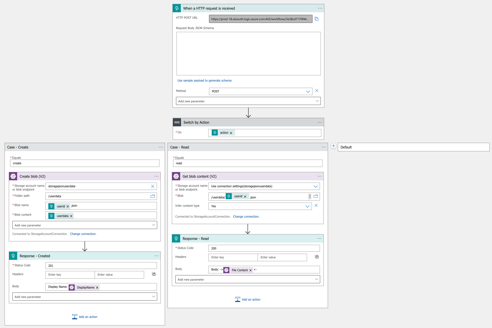

# azure-LA-logic-storage

#Request create
POST https://prod-18.uksouth.logic.azure.com:443/workflows/5e38cd7170f44e70aa8e86879ca55fa1/triggers/manual/paths/invoke?api-version=2016-10-01&sp=%2Ftriggers%2Fmanual%2Frun&sv=1.0&sig=sCrEgZI_q42qy7GKjjZk8scs1Ojq-uMQo98UqFmZbxg HTTP/1.1
Accept-Encoding: gzip,deflate
Content-Type: application/json
Content-Length: 114
Host: prod-18.uksouth.logic.azure.com:443
Connection: Keep-Alive
User-Agent: Apache-HttpClient/4.5.5 (Java/16.0.1)

{
	"action":"create",
	"userid":"202",
	"userdata":"{
		\"product1code\":\"202\",
		\"product1code\":\"203\"
	}"
}

#Response create
HTTP/1.1 201 Created
Cache-Control: no-cache
Pragma: no-cache
Content-Length: 22
Content-Type: text/plain; charset=utf-8
Expires: -1
x-ms-workflow-run-id: 08585126097002631194816968720CU18
x-ms-correlation-id: c06a44d6-8365-47cb-a7f8-fbc0a4f7c0f9
x-ms-client-tracking-id: 08585126097002631194816968720CU18
x-ms-trigger-history-name: 08585126097002631194816968720CU18
x-ms-execution-location: uksouth
x-ms-workflow-system-id: /locations/uksouth/scaleunits/prod-18/workflows/5e38cd7170f44e70aa8e86879ca55fa1
x-ms-workflow-id: 5e38cd7170f44e70aa8e86879ca55fa1
x-ms-workflow-version: 08585129706921748293
x-ms-workflow-name: LogicAppserData
x-ms-tracking-id: c06a44d6-8365-47cb-a7f8-fbc0a4f7c0f9
x-ms-ratelimit-burst-remaining-workflow-writes: 2999
x-ms-ratelimit-remaining-workflow-download-contentsize: 214748138
x-ms-ratelimit-remaining-workflow-upload-contentsize: 214748046
x-ms-ratelimit-time-remaining-directapirequests: 19999586
x-ms-request-id: uksouth:c06a44d6-8365-47cb-a7f8-fbc0a4f7c0f9
Strict-Transport-Security: max-age=31536000; includeSubDomains
Date: Mon, 10 Jul 2023 13:53:04 GMT

Display Name: 202.json

#Request read
POST https://prod-18.uksouth.logic.azure.com:443/workflows/5e38cd7170f44e70aa8e86879ca55fa1/triggers/manual/paths/invoke?api-version=2016-10-01&sp=%2Ftriggers%2Fmanual%2Frun&sv=1.0&sig=sCrEgZI_q42qy7GKjjZk8scs1Ojq-uMQo98UqFmZbxg HTTP/1.1
Accept-Encoding: gzip,deflate
Content-Type: application/json
Content-Length: 37
Host: prod-18.uksouth.logic.azure.com:443
Connection: Keep-Alive
User-Agent: Apache-HttpClient/4.5.5 (Java/16.0.1)

{
	"action":"read",
	"userid":"202"
}

#Response read
HTTP/1.1 200 OK
Cache-Control: no-cache
Pragma: no-cache
Transfer-Encoding: chunked
Content-Type: text/plain; charset=utf-8
Expires: -1
Vary: Accept-Encoding
x-ms-workflow-run-id: 08585126096219457400367473913CU09
x-ms-correlation-id: 198dca9d-8d13-4ba7-8559-3dfd5dbefe47
x-ms-client-tracking-id: 08585126096219457400367473913CU09
x-ms-trigger-history-name: 08585126096219457400367473913CU09
x-ms-execution-location: uksouth
x-ms-workflow-system-id: /locations/uksouth/scaleunits/prod-18/workflows/5e38cd7170f44e70aa8e86879ca55fa1
x-ms-workflow-id: 5e38cd7170f44e70aa8e86879ca55fa1
x-ms-workflow-version: 08585129706921748293
x-ms-workflow-name: LogicAppserData
x-ms-tracking-id: 198dca9d-8d13-4ba7-8559-3dfd5dbefe47
x-ms-ratelimit-burst-remaining-workflow-writes: 2999
x-ms-ratelimit-remaining-workflow-download-contentsize: 214748099
x-ms-ratelimit-remaining-workflow-upload-contentsize: 214748123
x-ms-ratelimit-time-remaining-directapirequests: 19999474
x-ms-request-id: uksouth:198dca9d-8d13-4ba7-8559-3dfd5dbefe47
Strict-Transport-Security: max-age=31536000; includeSubDomains
Date: Mon, 10 Jul 2023 13:54:23 GMT

Body: ->{
		"product1code":"202",
		"product1code":"203"
	}<-

#Request Unknown
POST https://prod-18.uksouth.logic.azure.com:443/workflows/5e38cd7170f44e70aa8e86879ca55fa1/triggers/manual/paths/invoke?api-version=2016-10-01&sp=%2Ftriggers%2Fmanual%2Frun&sv=1.0&sig=sCrEgZI_q42qy7GKjjZk8scs1Ojq-uMQo98UqFmZbxg HTTP/1.1
Accept-Encoding: gzip,deflate
Content-Type: application/json
Content-Length: 40
Host: prod-18.uksouth.logic.azure.com:443
Connection: Keep-Alive
User-Agent: Apache-HttpClient/4.5.5 (Java/16.0.1)

{
	"action":"rrrread",
	"userid":"202"
}

#Response Unknown
HTTP/1.1 404 Not Found
Cache-Control: no-cache
Pragma: no-cache
Content-Length: 14
Content-Type: text/plain; charset=utf-8
Expires: -1
x-ms-workflow-run-id: 08585126095626089525443059416CU01
x-ms-correlation-id: 09839b3b-6ad3-4a28-8ad7-b1e622661105
x-ms-client-tracking-id: 08585126095626089525443059416CU01
x-ms-trigger-history-name: 08585126095626089525443059416CU01
x-ms-execution-location: uksouth
x-ms-workflow-system-id: /locations/uksouth/scaleunits/prod-18/workflows/5e38cd7170f44e70aa8e86879ca55fa1
x-ms-workflow-id: 5e38cd7170f44e70aa8e86879ca55fa1
x-ms-workflow-version: 08585129706921748293
x-ms-workflow-name: LogicAppserData
x-ms-tracking-id: 09839b3b-6ad3-4a28-8ad7-b1e622661105
x-ms-ratelimit-burst-remaining-workflow-writes: 2999
x-ms-ratelimit-remaining-workflow-download-contentsize: 214748146
x-ms-ratelimit-remaining-workflow-upload-contentsize: 214748120
x-ms-ratelimit-time-remaining-directapirequests: 19999649
x-ms-request-id: uksouth:09839b3b-6ad3-4a28-8ad7-b1e622661105
Strict-Transport-Security: max-age=31536000; includeSubDomains
Date: Mon, 10 Jul 2023 13:55:22 GMT

Action Unknown

#Diagram
